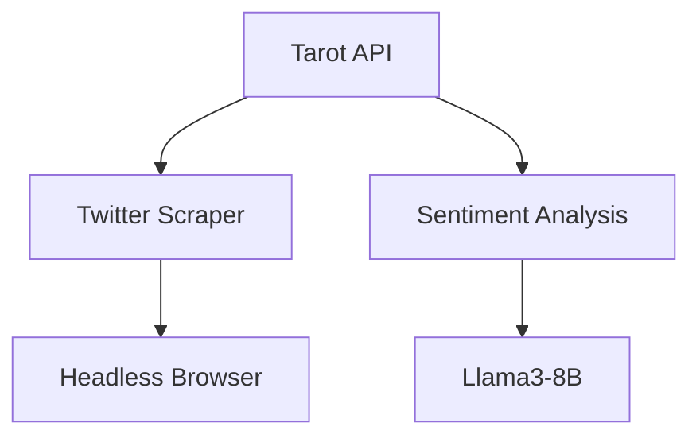

# Tarot Reading API

## Introduction
Welcome to the Tarot CD API! This API was created by our team of highly skilled and definitely not clumsy developers to solve the problem of unpredictable deployments. 
By harnessing the mystical powers of the Thoth Tarot deck, we can provide you with insightful readings to determine whether it's the right time to deploy your application to production.

## Problem Statement
Deployments can be a tricky and unpredictable process, fraught with potential issues and obstacles. Making the wrong deployment decision can lead to disastrous consequences for your application and your business. 
That's where the Tarot CD API comes in - by providing a data-driven approach to assessing the current state of your project, we can help you make informed decisions about when to deploy.

## Use Cases
This API can be integrated into your CI/CD pipeline to automate the decision-making process for deployments. Here are some example use cases:

1. Pre-Deployment Check: Before triggering a deployment, your pipeline can call the Tarot CD API to get a reading on the current state of your project. If the reading indicates a "good" outcome, the deployment can proceed. If the reading is "bad", the deployment can be halted or delayed.
2. Deployment Approval: Your team can use the Tarot CD API as a tool for approving deployments. Developers can request a reading, and the team can review the result before giving the final green light.
3. Troubleshooting: If you're experiencing issues with a recent deployment, you can use the Tarot CD API to get insights into the root cause. The reading may reveal underlying problems that need to be addressed before proceeding with further updates.

## Tarot Thoth Deck
The Tarot CD API uses the Thoth Tarot deck, designed by the famous occultist Aleister Crowley. This deck is known for its depth of symbolism and esoteric significance, making it a powerful tool for divination and spiritual exploration.
Each card in the Thoth Tarot deck has two possible meanings: an upright (positive) interpretation and a reversed (negative) interpretation. The API takes these nuances into account when generating the reading.

# Tarot CD API v2.0 🌙✨

**Esoteric-Technological Solution for CI/CD**  
*Now with Astrological Integration and AI Analytics*

## Release Notes (v2.0)
### New Features:
- 🌕 Real-time moon phase tracking
- 👤 Personalization by name (special logic for "Olegs")
- 🕰 Temporal factors: "Friday Evening Curse"
- 💹 Zimbabwe Dollar (ZWL) exchange rate integration
- 🐦 Elon Musk & Dasha Koreyka tweet analysis
- 🤖 Neural sentiment analysis (Llama3-8B)
- 🐳 Microservice architecture with Docker

### Known Limitations:
- 🚫 Twitter scraping may trigger CAPTCHAs
- ⏳ Sentiment analysis requires 4+ GB RAM
- 🌙 Moon phase accuracy ±2 days

## Enhanced Features

### 🔮 Advanced Prediction System
Now considers:
1. **Astrological Factors**
   - Current moon phase
   - Zodiac sign of responsible person
   - Planetary alignment

2. **Social Signals**
   - Latest tweet sentiment
   - Social media activity
   - Content virality

3. **Economic Indicators**
   - ZWL exchange rate
   - Cryptocurrency trends
   - Stock market indices

## Updated API Endpoints

### Basic Endpoints

* GET /cards: Returns full card list with metadata

#### POST /draw (New Format)
**Example Request:**
```json
{
  "num_cards": 5,
  "user_info": {
    "name": "Oleg Neurosvetov",
    "age": 42,
    "zodiac": "Cancer"
  }
}

```
**Example Response:**
```json
{
  "reading": "bad",
  "num_cards": 5,
  "drawn_cards": "The Tower, Judgement, The Moon, The Sun, The World",
  "factors": {
    "moon_phase": 72.3,
    "zwl_rate": 860,
    "sentiment_score": -34.5,
    "oleg_effect": true,
    "friday_evening": false
  }
}
```

## System Setup 🚀

### Requirements:
* Docker 20.10+
* Docker Compose 1.29+
* 8+ GB RAM
* Llama3-8B model (GGUF format)

### Installation

Download Llama3 model:
```
mkdir -p models && wget -P models https://example.com/path/to/llama-3-8b-instruct.Q4_K_M.gguf
```
Start the system:
```
docker-compose up --build
```

API will be available at http://localhost:5000

Microservice Architecture 🧩


### Environment Configuration
#### Variable	Description
* **USE_LLAMA**	- Enable AI analysis (true/false)
* **SENTIMENT_API_URL**	- Sentiment analysis service URL
* **TWITTER_SCRAPER_URL**	- Twitter scraping service URL


### CI/CD Example (GitLab) 🤖
```
deploy:
  stage: deploy
  variables:
    USE_LLAMA: "true"
  script:
    - docker-compose up -d
    - READING=$(curl -X POST -H "Content-Type: application/json" -d '{"num_cards": 5}' http://tarot-api:5000/draw | jq -r '.reading')
    - if [ "$READING" = "good" ]; then
        echo "🚀 Deployment approved! Moons are aligned!";
      else
        echo "🔮 Deployment blocked! Cards warn of danger!";
        exit 1;
      fi
```
### **Critical Warnings ⚠️**

* Friday Evenings:
    - All deployments after 6 PM Friday receive +30% failure chance.

* Oleg Effect:
    - If responsible person is named Oleg, positive predictions are reduced by 60%.

* Lunar Influence:
    - New moon increases deployment success probability by 15%.

# Docs for old releases

# Tarot CD API v1.0 🌙✨

## API Endpoints
The Tarot CD API provides the following endpoints:

* POST /draw: This endpoint allows you to request a Tarot reading. You need to provide the number of cards you'd like to draw (e.g., 5 cards). The API will randomly select the requested number of unique cards from the Thoth Tarot deck, and then analyze the reading to determine whether the outcome is "good" or "bad".
Example request:
```
{
  "num_cards": 5
}
```

Example response:
```
{
  "reading": "good",
  "num_cards": 5,
  "drawn_cards": "The Fool, The Magus, The Priestess, The Empress, The Emperor"
}
```

2. GET /cards: This endpoint returns the complete list of Thoth Tarot cards, including their arcana, suit, number, upright value, and reversed value.
Example response:
```
{
  "The Fool": {
    "arcana": "Major",
    "number": 0,
    "upright_value": 10,
    "reversed_value": -10
  },
  "The Magus": {
    "arcana": "Major",
    "number": 1,
    "upright_value": 8,
    "reversed_value": -8
  },
  // ... and so on
}
```

## Building and Running the API
To build and run the Tarot CD API, follow these steps:

1. Ensure you have Python 3.x installed on your system.
2. Create a virtual environment and activate it:
```
python3 -m venv venv
source venv/bin/activate
```

3. Install the required dependencies:
```
pip install -r requirements.txt
```

4. Run the Flask development server:
```
python app.py
```

5. The API will now be running at http://localhost:5000


## Example Usage with GitLab CI/CD

Here's an example of how you can integrate the Tarot CD API into a GitLab CI/CD pipeline:
```
image: python:3.9

stages:
  - test
  - deploy

test:
  stage: test
  script:
    - pip install -r requirements.txt
    - python -m unittest discover tests/

deploy:
  stage: deploy
  script:
    - pip install -r requirements.txt
    - python app.py &
    - READING=$(curl -X POST -H "Content-Type: application/json" -d '{"num_cards": 5}' http://localhost:5000/draw | jq -r '.reading')
    - if [ "$READING" = "good" ]; then
        echo "Deployment approved. Proceeding with release.";
        # Add your deployment commands here
      else
        echo "Deployment rejected. Tarot reading was '$READING'.";
        exit 1;
      fi
  only:
    - main
```

In this example, the pipeline first runs the unit tests in the "test" stage. Then, in the "deploy" stage, it starts the Tarot CD API, calls the /draw endpoint to get a reading, and checks the result. 
If the reading is "good", the pipeline proceeds with the deployment. If the reading is "bad", the pipeline fails the deployment.
Remember to adjust the pipeline configuration to fit your specific project and deployment workflow.
